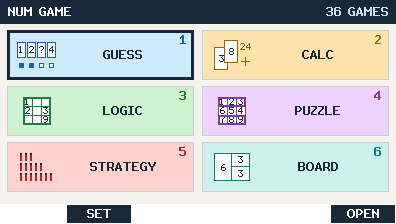

# NUM GAME

**36 native games for the CASIO fx-CG50**, written in C with fxSDK/gint. The calculator runs offline; Python is used only to generate and independently verify assets during development.

This is an **experimental prerelease**. Host tests and SH builds pass, but physical fx-CG50 acceptance is pending. The previously reported persistent MENU flashing remains unreproduced on hardware and its cause is unknown; see the [hardware procedure](docs/HARDWARE_RETEST.md).

Copy [NUMGAME.g3a](dist/NUMGAME.g3a) to calculator USB storage, disconnect safely, and open **NUM GAME**. Verify [SHA256SUMS.txt](dist/SHA256SUMS.txt). [NUMGDIAG.g3a](dist/NUMGDIAG.g3a) is a separate instrumented app with its own ND saves. No external puzzle files are required.



| Category | Six games |
|---|---|
| GUESS | Number Baseball, Equation Guess, Number Mind, Clue Lock, Sequence, Black Box |
| CALC | Make Target, Countdown, Missing Operators, Cross Math, Prime Factor, Cryptarithm |
| LOGIC | Sudoku, Calcudoku, Kakuro, Futoshiki, Skyscrapers, Hashi |
| PUZZLE | Hitori, Binary, Numbrix, Magic Square, Sum Grid, Nonogram |
| STRATEGY | Nim, Wythoff, Euclid, Make Fifteen, Race to Target, Reversi |
| BOARD | 2048, Sliding, Lights Out, Shikaku, Slitherlink, Net |

All 36 games have EASY/NORMAL/HARD/MASTER; the six LOGIC games also have HELL. Each added game has its own icon, rules, playable UI and save support. Difficulty labels reflect rules or independently checked solving metrics, not certified human ratings. See the [Korean user guide](docs/USER_GUIDE.md), [catalog](docs/GAME_CATALOG.md), [in-app rules](docs/RULES.md), and [renderer captures](docs/captures/README.md).

Navigate the two-by-three main and category grids with arrows or 1–6; EXE/F6 OPEN selects a tile. The single unfinished run has a small RESUME badge on its game tile, and Main F1 RESUME opens it directly. Before a game, use UP/DOWN to select **NEW GAME**, difficulty, or an applicable setting. The same game's entry adds a focused RESUME row. LEFT/RIGHT changes the selected setting and the footer explains the row. F6 OPEN starts the selected action; F5 opens RULES. There is no STATS screen or separate MODE popup. F3 toggles LOGIC HELL and shows a colored ENHM key when selected. Strategy FIRST selects YOU or CPU.

Number Baseball allows repeated digits, with 4/5/6/7 digits and **20/30/40/50 total guesses** for EASY/NORMAL/HARD/MASTER. Before the final guess, ONE LAST TRY appears once and can be dismissed to continue. Its complete attempt list scrolls. Make Target uses every card (four/four/five/six by level). Its TARGET row cycles, without wrapping, through **10, 24, 50, 100, 200, RANDOM**; EXE or F6 OPEN starts the selected setting. Each fixed target has 200 distinct decks per level. RANDOM selects from their shared 1,000-deck union at that level. Countdown may leave cards unused and now has 200 decks per level. Prime Factor's new bank contains composite targets with 3/3–4/4–5/5–6-digit bands by level. Magic Square FREE has blank 3×3/4×4/5×5/6×6 boards for EASY/NORMAL/HARD/MASTER. Nonogram completes when precisely the required black cells are filled; empty cells may remain blank or be marked X. 2048 tile colors progress from gray through lime, cyan, blue, yellow, orange and magenta to red. See [controls](docs/CONTROLS.md), [36-game content inventory](docs/CONTENT_INVENTORY.md), and the [difficulty audit](docs/DIFFICULTY_AUDIT.md).

Beta.6 expands the Make Target and Countdown banks while retaining exact legal-solution grading and the previous card rules. It rebalances Prime Factor by digit length and factor structure, extends Baseball attempts and history, and shows scroll position on long guessing/clue lists. NEW consumes a bank ordinal; RESUME restores the current puzzle without consuming one. Earlier unfinished games keep their original puzzle revisions. See the [cycle policy](docs/CONTENT_CYCLE.md), [card readability](docs/MAKE_TARGET_READABILITY_AUDIT.md), and [UI alignment](docs/UI_ALIGNMENT_AUDIT.md) audits.

The app retains **one unfinished run**. NEW GAME replaces it without a confirmation prompt, after the new run is safely committed. Completion removes RESUME; EXIT on the completion dialog shows the frozen final result, then EXIT returns to that game's entry or F6 NEW starts the next run. Two exact-length `NGSTATEA/B.dat` files protect the one logical save. A fresh empty pair is 252 bytes total; a fresh active pair is 3,996 bytes. Existing recent-five and older archive records migrate by keeping the most recent valid unfinished run. See [storage format](docs/STORAGE_FORMAT.md), [resume policy](docs/RESUME_POLICY.md) and [puzzle cycle](docs/CONTENT_CYCLE.md).

Normal and diagnostic apps use separate NG/ND save namespaces. NUM DIAG provides memory/runtime measurements, a bounded 1,000-iteration stress test and explicit `NDDIAG.txt` export. Actual device flash latency and memory peaks remain **HARDWARE TEST REQUIRED**; see the [beta.6 host sample](docs/PERFORMANCE_BETA6.md) and [diagnostic guide](docs/DIAGNOSTICS.md).

Build with an installed fxSDK/gint 2.11, SH GCC 14.1, CMake, fxgxa and Python 3. Set `NUMGAME_SDK_ROOT` if the SDK is elsewhere.

```sh
bash tools/test.sh
bash tools/verify_content.sh
bash tools/clean_build.sh
bash tools/clean_build.sh --diagnostic
python3 tools/captures.py
```

ASan is **not verified** because the available macOS runtime stalls before `main` even for a minimal program. UBSan, host mocks and SH builds do not replace hardware acceptance. Original code, puzzles and icons use [MIT](LICENSE); retained font/runtime and adapted infrastructure notices are in [THIRD_PARTY_NOTICES.md](THIRD_PARTY_NOTICES.md).
