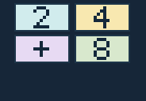

[English](README.md) | 한국어

<p align="center"></p>

# CASIO fx-CG50용 NUM GAME

오프라인 `.g3a` 애드인 하나에 담은 **네이티브 숫자 게임 36종**입니다. 분류와 게임을 고르면 별도 문제 파일 없이 플레이할 수 있습니다. 아래 아이콘과 화면은 실제 앱의 것입니다.

**실험적 사전 배포판 · v0.2.0-beta.8 · [MIT 라이선스](LICENSE)**

**[일반판 NUM GAME 다운로드](https://github.com/omegalpha210/fx-cg50-numgame/releases/download/v0.2.0-beta.8/NUMGAME.g3a)** · [문제 조사용 NUM DIAG](https://github.com/omegalpha210/fx-cg50-numgame/releases/download/v0.2.0-beta.8/NUMGDIAG.g3a) · [체크섬](https://github.com/omegalpha210/fx-cg50-numgame/releases/download/v0.2.0-beta.8/SHA256SUMS.txt) · [릴리스 설명](https://github.com/omegalpha210/fx-cg50-numgame/releases/tag/v0.2.0-beta.8) · [문제 신고](https://github.com/omegalpha210/fx-cg50-numgame/issues/new)

호스트 테스트와 엄격한 SH 빌드는 통과했습니다. 실제 fx-CG50에서의 최종 확인은 남아 있으며, 이전에 보고된 MENU 깜빡임, LCD 가독성, BFile 지연 시간과 메모리 최대치를 포함합니다. [실기 재검사 절차](docs/HARDWARE_RETEST.md).


*이 페이지의 화면은 현재 앱과 같은 C 렌더러를 호스트에서 실행해 얻은 396×224 캡처입니다. 계산기를 촬영한 사진이나 CPU 에뮬레이터 화면이 아닙니다. 휴대전화에서는 이미지를 열어 원래 크기로 보는 것이 좋습니다.*

## 여섯 분류에서 게임 고르기

| 분류 | 게임 6종 |
|---|---|
| **GUESS** | Number Baseball · Equation Guess · Number Mind · Clue Lock · Sequence Detective · Black Box |
| **CALC** | Make Target · Countdown · Missing Operators · Cross Math · Prime Factor · Cryptarithm |
| **LOGIC** | Sudoku · Calcudoku · Kakuro · Futoshiki · Skyscrapers · Hashi |
| **PUZZLE** | Hitori · Binary Puzzle · Numbrix · Magic Square · Sum Grid · Nonogram |
| **STRATEGY** | Nim · Wythoff · Euclid · Make Fifteen · Race to Target · Reversi |
| **BOARD** | 2048 · Sliding Puzzle · Lights Out · Shikaku · Slitherlink · Net |

모든 게임에 EASY, NORMAL, HARD, MASTER가 있고 LOGIC 여섯 게임에는 HELL도 있습니다. 난이도 표시는 규칙이나 검증한 풀이 지표에 따른 것이며 사람이 느끼는 난도를 실측했다는 뜻은 아닙니다. [전체 규칙](docs/RULES.md) · [콘텐츠 목록](docs/CONTENT_INVENTORY.md) · [난도 감사](docs/DIFFICULTY_AUDIT.md).

## 실제 플레이 화면

| GUESS: Number Baseball | CALC: Make Target |
|---|---|
|  |  |
| 같은 숫자가 반복될 수 있으며 난이도별 자릿수는 4–7개입니다. | 모든 카드를 한 번씩 사용하고 목표 10, 24, 50, 100, 200 또는 RANDOM을 고릅니다. |

| CALC: Prime Factor 입력 | CALC: Cryptarithm |
|---|---|
|  |  |
| LEFT/RIGHT로 커서를 움직이고, 이 게임에서만 물리 x² 키로 `^2`를 넣습니다. | 표시된 산술 조건에 맞게 문자에 숫자를 배치합니다. |

| LOGIC: Sudoku | LOGIC: Kakuro |
|---|---|
|  |  |
| 행·열·상자 규칙에 맞게 칸을 채웁니다. | 가로·세로 단서의 합을 맞춥니다. |

| PUZZLE: Nonogram | PUZZLE: Magic Square |
|---|---|
|  |  |
| 단서가 가리키는 검은 칸을 표시합니다. | 지정된 행·열·대각선의 합을 맞춥니다. |

| STRATEGY: Reversi | BOARD: 2048 |
|---|---|
|  |  |
| CPU와 대국하며 누가 먼저 둘지 고릅니다. | CLASSIC은 규칙이 고정이고, 별도 목표 모드에는 완료 조건이 있습니다. |

| BOARD: Shikaku | BOARD: Slitherlink |
|---|---|
|  |  |
| 단서 숫자에 맞게 격자를 직사각형으로 나눕니다. | 단서를 만족하는 닫힌 고리 하나를 그립니다. |

[더 많은 실제 렌더러 화면](docs/captures/README.md) · [대표 화면 모음](docs/GALLERY.md).

## 한 판 시작하고 마치기

**분류 → 게임 → 난이도·필요한 설정 → NEW GAME → 플레이** 순서입니다. 메뉴에서는 방향키나 숫자 1–6으로 이동하고 EXE 또는 F6 OPEN으로 엽니다. 시작 화면에서는 UP/DOWN으로 NEW GAME, 난이도나 필요한 설정을 선택하고 LEFT/RIGHT로 값을 바꿉니다. F5는 RULES입니다. 같은 게임의 미완료 기록은 RESUME으로 표시되고 메인 F1에서도 바로 열 수 있습니다. 해당 LOGIC 게임은 F3로 HELL을 전환합니다. 전략 게임의 FIRST는 YOU/CPU 중에서 고릅니다.

Equation Guess, Make Target, Countdown, Prime Factor의 수식 입력에서는 LEFT/RIGHT가 입력 커서를 움직이고, DEL은 커서 앞 글자를 지우며, 새 글자는 커서 위치에 들어갑니다. 긴 식은 입력칸 안에서 가로로 스크롤합니다. 기존 물리 `^` 키는 그대로 `^`이고, **x² 키는 거듭제곱을 허용하는 Prime Factor에서만 `^2`를 입력**합니다. Equation Guess의 SHIFT+DOT `=`도 유지합니다. 격자 이동, 카드 선택, UP/DOWN 기록 스크롤은 각 게임의 기존 조작입니다. [전체 조작표](docs/CONTROLS.md).

제공되는 HINT·ANSWER를 사용하면 해당 판은 assisted로 기록됩니다. 잘못 제출한 수식도 지우지 않고 커서로 고칠 수 있습니다. 완료창에는 게임에 맞는 지표만 표시합니다. Prime Factor는 시간 표시 설정이 켜졌을 때 시간과, 도움을 사용했을 때만 ASSISTED를 보여주며 내부 제출 횟수를 MOVES라 부르거나 SCORE 0을 표시하지 않습니다. 완료창에서 EXIT을 누르면 수정할 수 없는 최종 화면을 볼 수 있고 EXE 또는 F6 NEW로 다음 판을 시작합니다.


## 저장·콘텐츠·빌드

앱에는 **미완료 진행 기록 하나**만 남습니다. NEW를 시작하면 안전하게 저장한 뒤 기존 진행 기록을 교체하고, 완료하면 RESUME이 사라집니다. `NGSTATEA/B.dat`는 한 논리 저장을 보호하는 두 사본입니다. 빈 사본 둘은 합계 252바이트이고, 새 게임을 저장한 사본 둘은 3,996바이트입니다. 진단판은 별도 ND 파일을 사용합니다. 이전 Make Target 은행을 포함해 지원되는 구형 저장도 불러옵니다. [저장 형식](docs/STORAGE_FORMAT.md) · [이어하기 정책](docs/RESUME_POLICY.md).

Make Target은 난이도별로 카드 4/4/5/6장을 전부 한 번씩 쓰며 Countdown은 카드를 남겨도 됩니다. beta.7 이후 Make Target의 동일한 beta.6 문제 4,000개는 63,000바이트 압축 은행에 들어 있습니다. 카드·힌트·정답·ID·출제 순서는 바뀌지 않았습니다. 은행과 다른 콘텐츠를 독립 검증하지만 사람의 체감 난도나 실기 성능을 보증한다는 뜻은 아닙니다. [압축 감사](docs/MAKE_TARGET_PACKING_AUDIT.md) · [사용 안내](docs/USER_GUIDE.md).

일반판 `.g3a`를 계산기 USB 저장소에 복사한 뒤 안전하게 연결을 해제하세요. NUM DIAG는 RAM·시간 문제를 조사할 때만 쓰며 명시적 조작으로 `NDDIAG.txt`를 내보낼 수 있습니다. 소스 빌드에는 설치된 fxSDK/gint 2.11, SH GCC 14.1, CMake, fxgxa, Python 3이 필요합니다. SDK 위치가 다르면 `NUMGAME_SDK_ROOT`를 설정하세요.

```sh
bash tools/test.sh
bash tools/verify_content.sh
bash tools/clean_build.sh
bash tools/clean_build.sh --diagnostic
python3 tools/curate_readme.py
```

사용 가능한 macOS 환경에서는 ASan이 `main`에 들어가기 전에 멈춰 **미검증**입니다. 호스트 테스트·UBSan·SH 빌드만으로 실기 지연 시간이나 MENU 이슈의 해결 여부를 판단할 수 없습니다. [진단 안내](docs/DIAGNOSTICS.md) · [코드 정리 감사](docs/CODE_CLEANUP_AUDIT.md) · [외부 출처 고지](THIRD_PARTY_NOTICES.md).
