# NUM GAME renderer gallery

These 396×224 images were produced by the current C renderer in the host capture test, then copied by `python3 tools/curate_readme.py` from `build-host/captures/*.ppm`. They are not hardware photographs. The launcher icon is the original `assets/icon-sel.png` enlarged by an exact nearest-neighbor factor of two. [All test frames](captures/README.md) include entry, RULES, difficulty and edge-case states.

| Screen | Frame |
|---|---|
| Main | 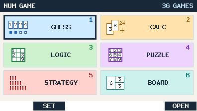 |
| Number Baseball | 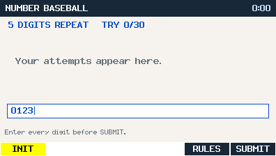 |
| Make Target | 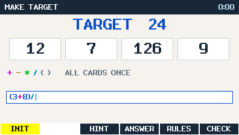 |
| Prime Factor cursor | 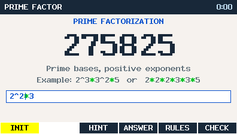 |
| Prime Factor completed | 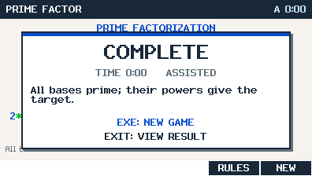 |
| Prime Factor final view | 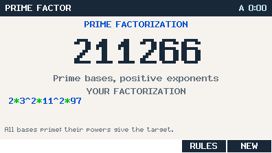 |
| Cryptarithm | 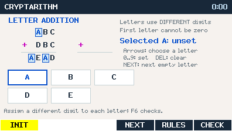 |
| Sudoku | 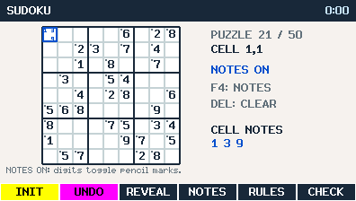 |
| Kakuro | 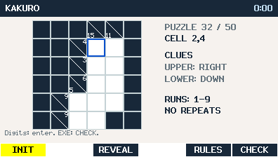 |
| Nonogram | 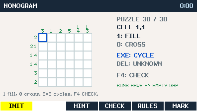 |
| Magic Square | 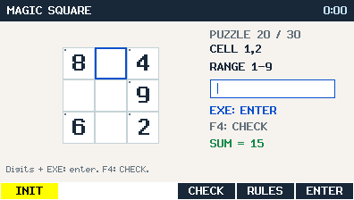 |
| Reversi | 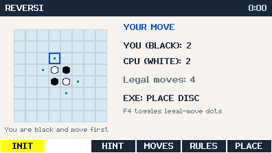 |
| 2048 | 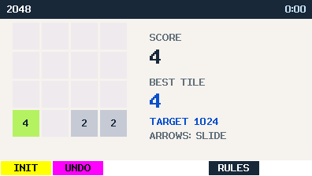 |
| Shikaku | 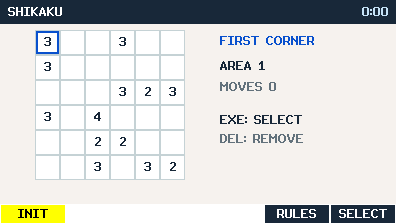 |
| Slitherlink | 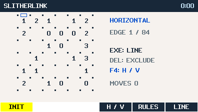 |
